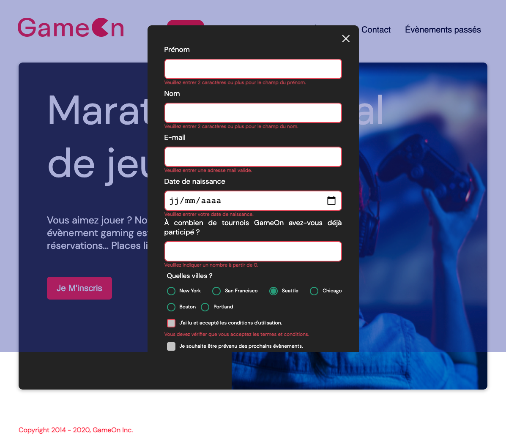

  

# GameOn

## Description

Projet 4 du parcours développeur Front-end chez Openclassrooms qui a pour objectif d'ajouter le code JavaScript manquant pour que le formulaire d'inscription au concours de jeux vidéos soit pleinement fonctionnel. Les usagers pourront réserver via un formulaire et des messages d'erreurs les aideront a bien remplir le formulaire si les champs ne sont pas valides.

## Maquette mobile de la page d'accueil

## Maquette mobile de la modale du formulaire

## Éléments fournis par l’entreprise virtuelle

- La maquette mobile de la page d’accueil, de la modale formulaire et de la modale confirmation de la réservation [Maquettes](https://www.figma.com/file/prxFGnSUoEhk6PTcMaJQim/UI-Design-GameOn-EN?node-id=0%3A1)
- Le repo du code déja complété [Repo](https://github.com/OpenClassrooms-Student-Center/GameOn-website-FR/)
- Les issues sur le repo GitHub qui décrivent ce qu'il reste à faire [Issues](https://github.com/OpenClassrooms-Student-Center/GameOn-website-FR/issues)

## Cahier des charges

- Il faudra travailler sur un repo GitHub forké
- Le développement devra se faire en HTML, CSS, et JavaScript Pur (Pas de jQuery)
- Il faudra utiliser des fichiers séparés pour le HTML, CSS et le Javascript
- Le code devra être commenter (les fonctions et les parties du code qui nécessitent plus de détails)
- Il faudra tester manuellement les fonctionnalités, les entrées du formulaire et l'affichage reponsive.
- Le site devra être compatible avec Chrome et Firefox

## Outils utilisés

### Fermer la modale
- Ajouter la fonctionnalité au bouton croix (X) du formulaire 

### Implémenter les entrées du formulaire
- Lier les labels aux entrées dans le HTML en utilisant les attributs "for" et "id" dans le code existant. Corriger le code HTML quand nécessaire. 
- Le formulaire doit être valide quand l'utilisateur clique sur "Submit"
- Les données doivent être saisies correctement :
(1) Le champ Prénom a un minimum de 2 caractères / n'est pas vide.
(2) Le champ du nom de famille a un minimum de 2 caractères / n'est pas vide.
(3) L'adresse électronique est valide.
(4) Pour le nombre de concours, une valeur numérique est saisie.
(5) Un bouton radio est sélectionné.
(6) La case des conditions générales est cochée, l'autre case est facultative / peut être laissée décochée.
- Conserver les données du formulaire (ne pas effacer le formulaire) lorsqu'il ne passe pas la validation.

### Ajouter les messages d'erreur
- Des messages d'erreur spécifiques doivent apparaître sous l'entrée qui n'est pas correcte. Les messages d'erreur doivent s'afficher sous le champ de saisie associé.
- Une bordure rouge autour du champs devra apparaitre sous le champs non valide. 

### Ajouter confirmation quand l'envoi du formulaire est réussi
- Après une validation réussie, inclure un message de confirmation de la soumission réussie pour l'utilisateur

### Tests manuels
- Visualiser et tester l'interface utilisateur dans les dernières versions de Chrome et de Firefox, ainsi que dans les versions mobile et desktop. Corriger les erreurs d'affichage existantes.- Tester toutes les fonctionnalités des boutons et des entrées de formulaire (tester les valeurs correctes et incorrectes)

## Outils utilisés

- Visual Studio Code avec les plugins Live server
- Git
- GitHub pour le versionning
- Heberger le site sur GitHub Pages